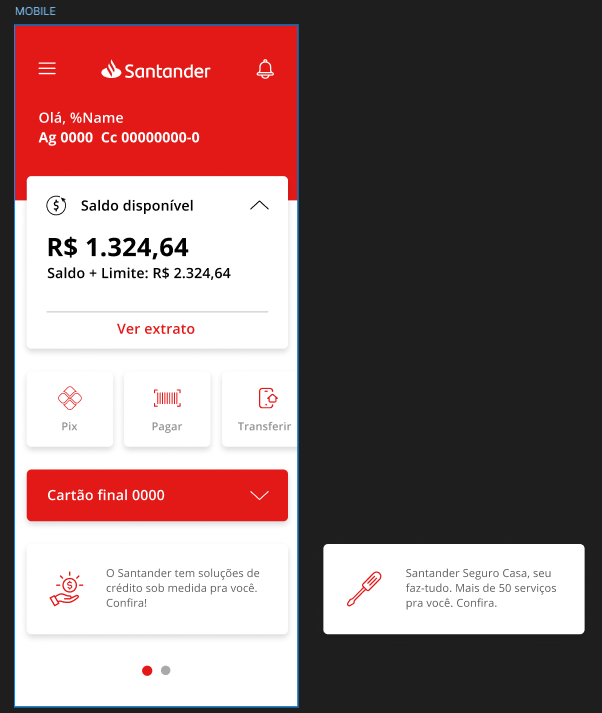

##  DESAFIO: Publicando Sua API REST na Nuvem Usando Spring Boot 3, Java 17 e Railway

### Desenvolvido na linguagem Java

## Descrição

Este é um projeto de uma API REST para o desafio Publicando Sua API REST na Nuvem Usando Spring Boot 3, Java 17 e Railway da DIO.
A aplicação abstrai as caracterisitcas de uma tela de aplicativo do banco santander. 

## Tecnologias utilizadas

| Tecnologia         | 
| ------------------ | 
| Java               | 
| Spring             | 
| H2 Database        | 
| Springdoc Open API | 
| Lombok             | 

## Profiles

Para esta aplicação foi criado o perfil:

* dev- para subir a aplicação em memória utilizando o H2
* prd - para subir a aplicação no railway

## Diagrama de classes

## Endpoints

### Users

| Método HTTP | Prefixo | Endpoint          | Descrição                               |
| ----------- | ------- | ----------------- | --------------------------------------- |
| GET         | /api/v1 | /user             | Retorna uma lista paginada de usuários  |
| GET         | /api/v1 | /user/1           | Retorna o usuário com o id 1            |
| POST        | /api/v1 | /user             | Cria um usuário                         |
| PUT         | /api/v1 | /user/1           | Atualiza o usuário com o id 1           |
| DELETE      | /api/v1 | /user/1           | Remove o usuário com o id 1             |

